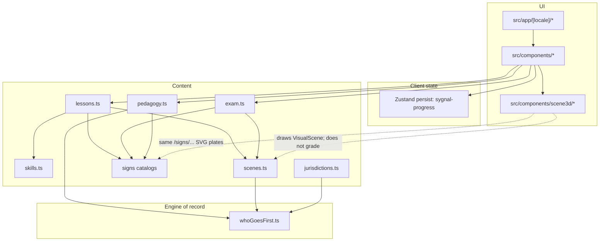
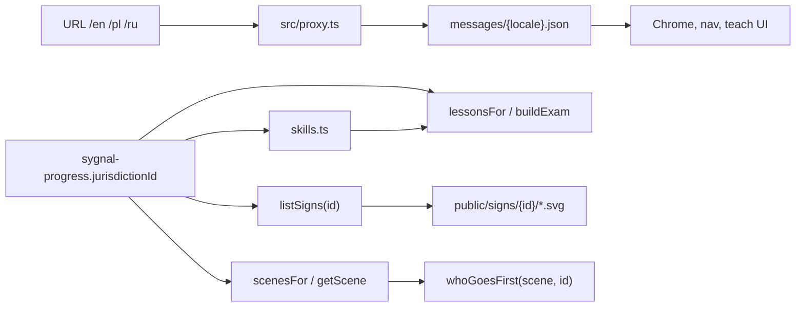
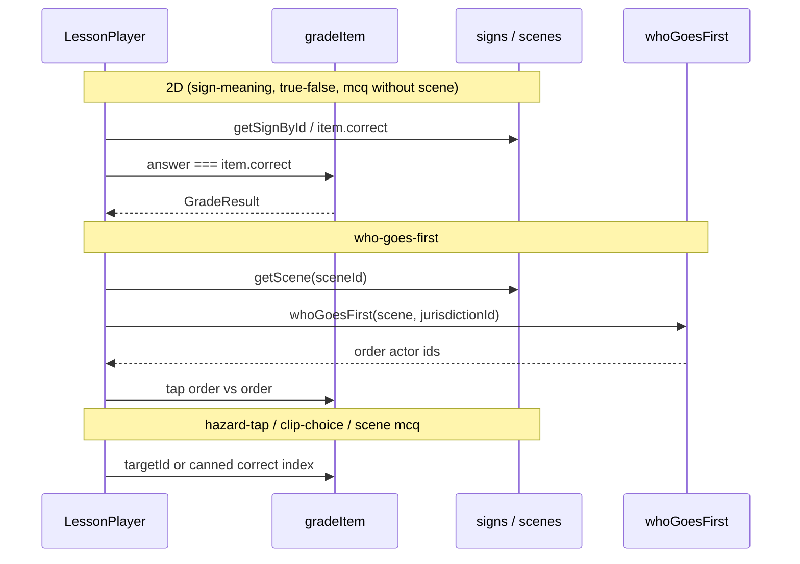

# Architecture

Sygnal is a Next.js 16 App Router PWA. UI language and road-rule packs are independent. The TypeScript right-of-way function is the answer key; React Three Fiber only draws the scene.

Agent map: [`../AGENTS.md`](../AGENTS.md). Sign licenses: [`../ATTRIBUTION.md`](../ATTRIBUTION.md).

## Layers

Request path: `src/proxy.ts` (next-intl) → `src/app/[locale]/layout.tsx` (`NextIntlClientProvider` + `AppShell`) → page → client component. Pages are thin; logic lives in `src/components/*` and `src/content/*`.

## Locale vs jurisdiction

| Axis | Values | Where it lives | What it changes |
| --- | --- | --- | --- |
| Locale | `en`, `pl`, `ru` | URL prefix; next-intl | Chrome strings; `LocalizedName` pick |
| Jurisdiction | `PL`, `DE`, `US-CA`, `RU`, `UA` | Zustand `jurisdictionId` | Sign catalog, skill graph, scenes, generated lessons/exam, engine pack rules |

A Polish URL with `jurisdictionId: "US-CA"` shows MUTCD plates and four-way-stop defaults, with Polish chrome (`messages/pl.json`). Covered by `e2e/exam-i18n.spec.ts`.

Pack rules (`src/content/jurisdictions.ts`): Vienna vs MUTCD, `trafficHand`, `defaultRightOfWay`, `tramPriority`, speed unit, urban default speed. `whoGoesFirst` reads this via `getJurisdiction`.

US-CA skill graph omits Vienna-only nodes (`lights`, `roundabout`, `special`). DE/RU/UA still reuse some PL `sceneIds` for shared clips.

## Lesson item data flow

| `LessonItem.type` | Learner action | Graded against |
| --- | --- | --- |
| `sign-meaning` | Pick a plate | `item.correct` (choice index) |
| `true-false` | Yes / no | `item.correct` |
| `mcq` | Pick copy | `item.correct` (may attach `sceneId` for the picture only) |
| `who-goes-first` | Tap actor **buttons** in order | `whoGoesFirst(scene, jurisdiction).order` |
| `hazard-tap` | Tap one actor | `item.targetId` |
| `clip-choice` | MCQ after a short clip | `item.correct` |

`src/content/grade.ts` is the only grader. `src/content/pedagogy.ts` explains the same item (and calls the engine for junction copy). `ts-fsrs` updates `progress.cards` after check.

Exam (`src/content/exam.ts`): 20 yes/no + 12 abc = 32 questions, points sum to 74, pass 68. Scene abc rows are WORD-style MCQ (`correct: 0`), not tap-order, even when a 3D scene is shown.

## 3D is visualization

`SceneCanvas` tries WebGPU then WebGL. `IntersectionSceneView` places vehicles and `SignBillboard` textures (`sign.src` or data-URI fallback SVG). Actor ids are exposed as HTML buttons (`Html` from drei) so tests and learners can click them.

Do not move grading into the canvas, shaders, or animation `clipT`.

## Client persist

Key: `sygnal-progress`. Default: `jurisdictionId: "PL"`, `attentionMode: "focus"`, `qualityOverride: "auto"`. Focus forces `detectQuality` → `low` regardless of override (`src/lib/useQuality.ts`).

XP: +10 per correct item plus +10 per finished lesson (`src/lib/xp.ts`). Driving days increment on lesson complete unless `drivingDays.paused`.

## Routes

| Path | Client |
| --- | --- |
| `/[locale]` | Onboarding or home (`HomeClient`) |
| `/[locale]/learn` | Skill path (`LearnClient`) |
| `/[locale]/lesson/[lessonId]` | `LessonPlayer` |
| `/[locale]/hub` | 3D town; skill buttons |
| `/[locale]/exam` | `ExamPlayer` |
| `/[locale]/drive` | Practice loop |
| `/[locale]/settings` | Locale links, jurisdiction, Focus/Play, quality |
